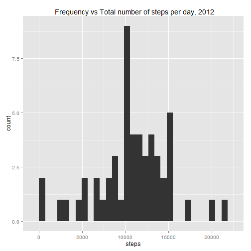
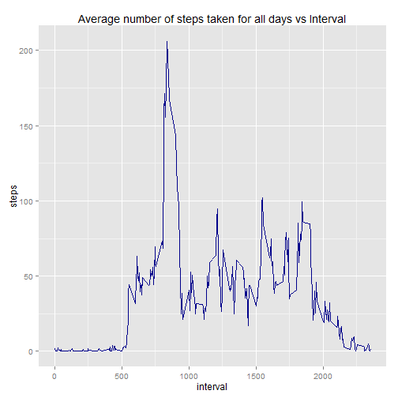
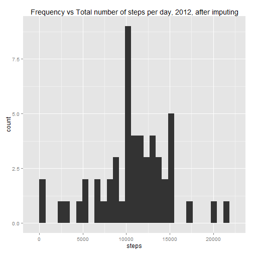
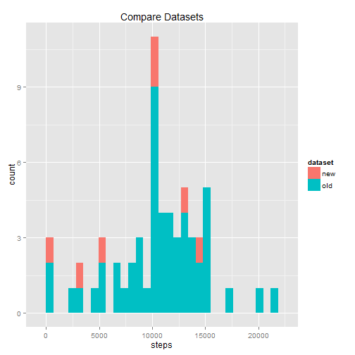
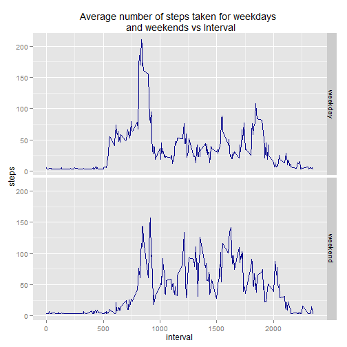

# Reproducible Research: Peer Assessment 1
In this assignment, we examine the Activity monitoring data (activity.zip) through the questions presented below.

The data is from a personal activity monitoring device. This device collects data at 5 minute intervals through out the day. The data consists of two months of data from an anonymous individual collected during the months of October and November, 2012 and include the number of steps taken in 5 minute intervals each day.

## Loading and preprocessing the data
To start the analysis, the following steps are performed:

1. Download the activity.zip file from this repository.
2. Extract the file "activity.csv" to your R working directory.
3. Read the file into R using the following code.


```r
activityRaw <- read.csv("activity.csv", header=TRUE)
```

## What is mean total number of steps taken per day?
1\. Missing values are then removed from the raw data loaded earlier.  
2\. The number of steps is then tabulated for each day with available data.  
3\. Histogram of total number of steps taken each day is plotted using ggplot2.  


```r
## Remove missing values
activityData <- na.omit(activityRaw)
activityData$date <- as.Date(activityData$date, format="%Y-%m-%d")

## tabulate sum
totalStepsPerDay <- aggregate(steps ~ date, data=activityData, FUN=sum)

## plot histogram
library(ggplot2)
histplot <- ggplot(totalStepsPerDay, aes(x=steps)) + geom_histogram()
histplot <- histplot + ggtitle(" Frequency vs Total number of steps per day, 2012")
histplot
```

```
## stat_bin: binwidth defaulted to range/30. Use 'binwidth = x' to adjust this.
```

 

4\. The mean and median total number of steps taken per day are as below.  


```r
mean(totalStepsPerDay$steps)
```

```
## [1] 10766
```

```r
median(totalStepsPerDay$steps)
```

```
## [1] 10765
```

## What is the average daily activity pattern?
1\. Average number of steps taken, averaged across all days, is calculated for each of the intervals in the data as shown below.  


```r
averageStepsInterval <- aggregate(steps~interval, data=activityData, FUN=mean)
```
2\. A time series plot of the 5-minute interval (x-axis) and the average number of steps taken, averaged across all days (y-axis) is then plotted below.  


```r
## plot time series
timeSeriesPlot <- ggplot(averageStepsInterval, aes(interval, steps)) + geom_line(colour="darkblue", stat="identity") 
timeSeriesPlot <- timeSeriesPlot + xlab("interval") + ylab("steps")
timeSeriesPlot <- timeSeriesPlot + ggtitle("Average number of steps taken for all days vs Interval")
timeSeriesPlot
```

 

3\. The  5-minute interval, on average across all the days in the dataset, contains the maximum number of steps is derived below.  


```r
averageStepsInterval <- averageStepsInterval[order(averageStepsInterval[,2],decreasing=TRUE),]
averageStepsInterval[1,]
```

```
##     interval steps
## 104      835 206.2
```

## Imputing missing values
1\. Number of missing values in the dataset is derived below


```r
nrow(activityRaw[!complete.cases(activityRaw),])
```

```
## [1] 2304
```

2\. Missing values are imputed with the average steps taken per day calculated from the original dataset.  

```r
## missing values are identified
missingValues <- is.na(activityRaw$steps)

## mean steps per day is calculated
meanImpute <- aggregate(steps ~ date, activityRaw, mean)
activityNew <- activityRaw

## For missing values of each day, the mean steps for that day is imputed
activityNew[missingValues,  "steps"]  <-  meanImpute[activityNew[missingValues,  "date"], "steps"]
```

3\. Histogram of the total number of steps taken each day from the new imputed data is created below.  


```r
totalStepsPerDayNew <- aggregate(steps ~ date, data=activityNew, FUN=sum)
histplotNew <- ggplot(totalStepsPerDayNew, aes(x=steps)) + geom_histogram()
histplotNew <- histplot + ggtitle("Frequency vs Total number of steps per day, 2012, after imputing")
histplotNew
```

```
## stat_bin: binwidth defaulted to range/30. Use 'binwidth = x' to adjust this.
```

 

4\. The mean and median total number of steps taken per day are as below.

```r
mean(totalStepsPerDayNew$steps)
```

```
## [1] 10448
```

```r
median(totalStepsPerDayNew$steps)
```

```
## [1] 10586
```

5\. From the data below mean and median has been lowered in the imputed data. Visually, the lowered values results from more sample of values in the lower step value ranges, however the dataset varies little overall.

```r
mean(totalStepsPerDayNew$steps)- mean(totalStepsPerDay$steps)
```

```
## [1] -318.5
```

```r
median(totalStepsPerDayNew$steps)- median(totalStepsPerDay$steps)
```

```
## [1] -179.5
```

```r
totalStepsPerDay$dataset <- "old"
totalStepsPerDayNew$dataset <- "new"
combinedTotalSteps <- rbind(totalStepsPerDay,totalStepsPerDayNew)
ggplot(combinedTotalSteps, aes(x=steps, fill=dataset)) +
    geom_histogram(position="identity") + ggtitle("Compare Datasets")
```

```
## stat_bin: binwidth defaulted to range/30. Use 'binwidth = x' to adjust this.
```

 

## Are there differences in activity patterns between weekdays and weekends?
1\. The days are first derived using the weekdays function.
2\. The days are then subsequently grouped into "weekday" or "weekend" in the daytype column.  


```r
## Derive days and group into "weekday" and "weekend"
activityNew$day <- weekdays(as.Date(activityNew$date))
activityNew$daytype <- "undefined"
weekend <- c("Saturday", "Sunday")
activityNew[grepl("Saturday|Sunday", activityNew$day),  "daytype"]  <-  "weekend"
activityNew[grepl("Monday|Tuesday|Wednesday|Thursday|Friday", activityNew$day),  "daytype"]  <-  "weekday"
```
3\. The average steps taken per interval is then calculated and grouped by day type.


```r
averageStepsIntervalNew <- aggregate(steps~interval+daytype, data=activityNew, FUN=mean)
```

4\. A panel plot is then generated for weekday and weekend activity as shown below. Visually, the average steps taken is distributed more evenly during weekends then on weekdays over the interval period.


```r
## Panel Plot
patternplot <- ggplot(averageStepsIntervalNew, aes(interval, steps)) + geom_line(colour="darkblue", stat="identity")
patternplot <- patternplot + ggtitle("Average number of steps taken for weekdays \n and weekends vs Interval")
patternplot <- patternplot + facet_grid(daytype ~ .)
patternplot
```

 
